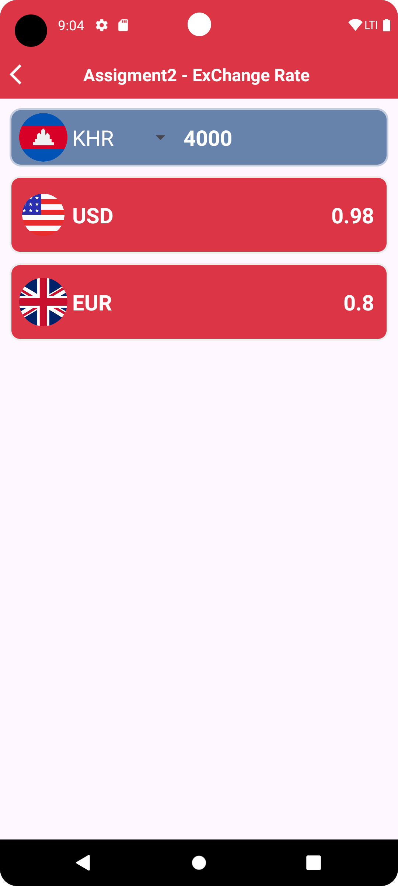

# assignment-android
Exercise 01: Currency Exchange
    Create Main Activity with following buttons
    Khmer Riels to USD
    USD to Khmer Riels
    Khmer Riels to Euro
    Euro to Khmer Riels
Each button call each activity to calculate the exchange rate
    One edit text (number)
    One button
    One text view for output result
    

Exercise 02: How to create Menu
    